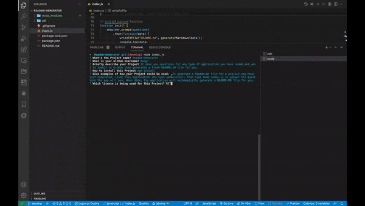

# Readme-Generator

## Video Demonstration

## Repository
___
https://github.com/Bwogi/Readme-Generator
## Description
---
It asks you questions for any type of application you have coded and want to submit to GitHub then generates a fresh README.md file for you.
## Table of Contents 
---
* [Installation](#installation)
* [Usage](#usage)
* [License](#license)
* [Badges](#badges)
* [Contributing](#contributing)
* [Tests](#tests)
---
## Installation
___
 
npm install
---
## Badges

## Usage
___
To generate a Readme.md file for a project you have just completed, clone this application and type npm install. Then type node index.js to answer the questions the app will ask. When done, the application will automagically generate a README.MD file for you.
## License
___
This project is licensed under the MIT license. 

## Contribution
___
Contributors: 2
## Tests
___
The following is needed to run the test: 
## Questions
___
For any enquiries about this repo, open an issue or shoot me an email at: andrew.bwogi@gmail.com.
